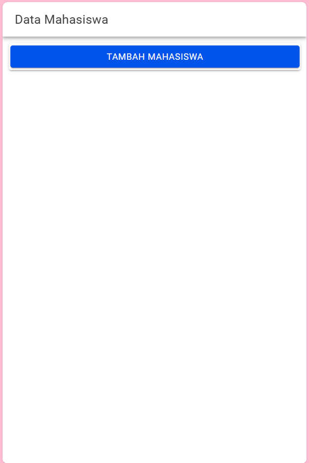

# LabMobile8_SyadinaZufarin_Shift-F
Tugas Pertemuan 9
Link lengkap Source Code : 

https://drive.google.com/file/d/11Op6k2eM9jHdHxsKWw3hf70q5cuLP9cS/view?usp=sharing

### Halaman Home
Halaman ini menampilkan halaman putih dengan button biru bertuliskan "Tambah Mahasiswa" yang nantinya digunakan untuk menambahkan data mahasiswa

Ketika kita klik button "Tambah Mahasiswa" maka akan muncul tampilan seperti ini untuk menambahkan data mahasiswa yang kita inginkan 

### Halaman tampil data
Halaman ini akan menampilkan data-data mahasiswa yang sudah kita input melalui button "Tambah Mahasiswa". Halaman ini akan menampilkan data mahasiswa beserta opsi untuk melakukan edit atau hapus data. Kita dapat memasukkan banyak data mahasiswa di dalam halaman ini. 

### Halaman Edit Data

Edit data merupakan opsi aksi yang dapat dilakukan terhadap data-data mahasiswa yang sudah kita input sebelumnya. Data yang sudah kita input dapat kita edit melalui button "Edit" yang terletak di samping data mahasiswa. 

Setelah di edit maka hasilnya akan berubah menjadi seperti ini : 

### Halaman Hapus Data

Hapus data juga merupakan opsi aksi lain yang dapat dilakukan terhadap data-data mahasiswa yang sudah kita input sebelumnya. Data yang sudah kita input dapat kita hapus melalui button "Hapus" yang terletak di samping data mahasiswa. 
Kita coba untuk menambahkan satu data sebagai data percobaan untuk dihapus 

Tampilan data sebelum dihapus menjadi seperti ini :

Kita coba untuk klik button "Hapus" maka akan muncul konfirmasi apakah kita yakin untuk menghapus data tersebut atau tidak.

Maka, setelah data tersebut dihapus akan menjadi seperti ini list data yang kita miliki 

